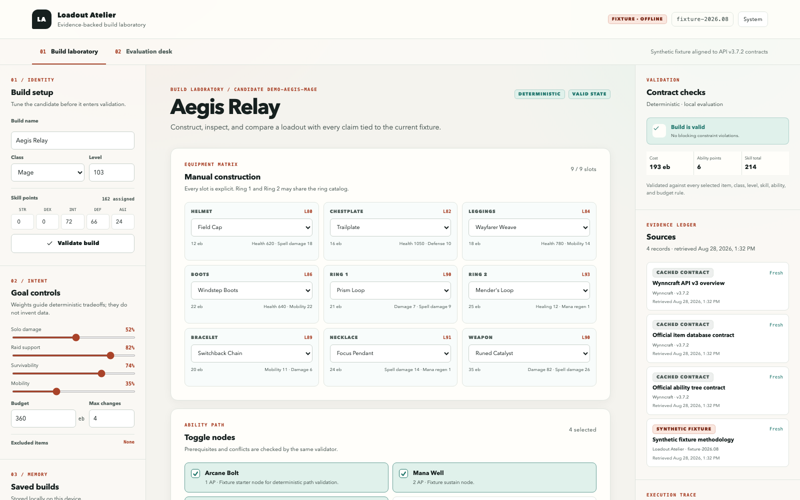
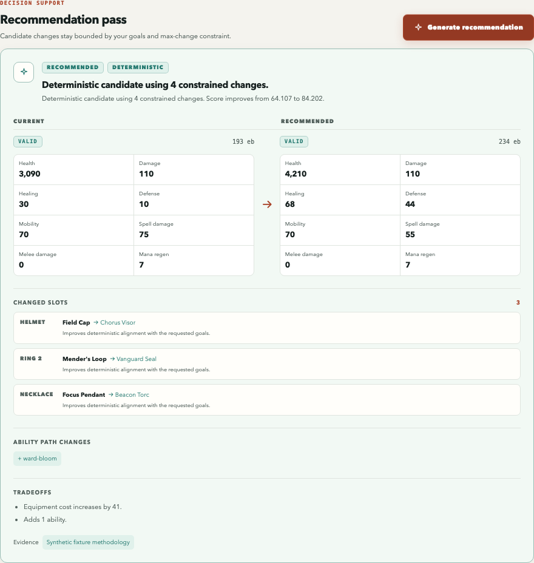
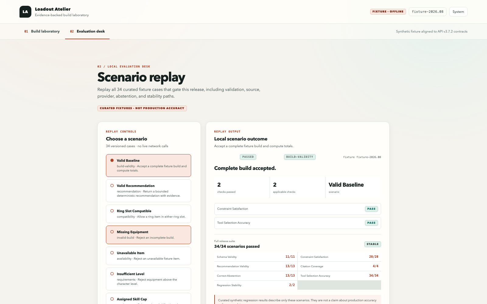
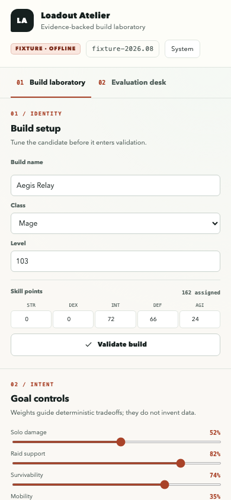

# Loadout Atelier

**A patch-aware build laboratory with deterministic validation and evidence-backed explanations.**

[Live fixture demo](https://ronaldoj24.github.io/loadout-atelier/) · [Architecture](docs/ARCHITECTURE.md) · [Evaluation method](docs/EVALUATIONS.md) · [API research](docs/API_RESEARCH.md)

Loadout Atelier turns build planning into an inspectable workflow. Construct a Wynncraft-style loadout, state the outcome you care about, and compare a constrained recommendation against the current build. Every compatibility, requirement, stat, budget, and ability-tree conclusion comes from deterministic TypeScript. AI is an optional local explanation layer; it cannot make an invalid proposal valid.

The public demo is deliberately honest: its small item and ability dataset is synthetic and versioned, while its API shape and policy decisions are grounded in official Wynncraft documentation. It works offline and does not need a player identity or provider key.

> Unofficial project. Not affiliated with or endorsed by Wynncraft. Fixture values are fictional and are not live gameplay advice.



<details>
<summary>More screenshots</summary>







</details>

## What you can inspect

- manual equipment, class, level, skill-point, ability, budget, and goal controls;
- deterministic invalid-build explanations with exact field paths;
- current-versus-proposed equipment and computed stat tradeoffs;
- visible source mode, retrieval time, dataset version, citations, and tool traces;
- local build saves, JSON export, and re-evaluation against a prior fixture patch;
- replayable recommendation and failure scenarios with exact metric denominators;
- optional public-profile and DeepSeek adapters behind a local Node service.

There is no chat surface, account system, cloud database, payment layer, or social feature.

## Quick start

Requirements: Node.js 22 or newer.

```bash
git clone https://github.com/RonaldoJ24/loadout-atelier.git
cd loadout-atelier
npm ci
npm run dev
```

Open `http://localhost:4173`. The fixture workspace is complete without a backend.

For the optional local service:

```bash
cp .env.example .env.local
npm run dev:server
```

Set `DEEPSEEK_API_KEY` only in `.env.local` or the process environment. The key is read by `server/` and must never use a `VITE_*` name. Public Wynncraft reads do not require an account token in the MVP.

## Five-minute demo

1. Start on **Workspace** and inspect the prominent `fixture-2026.08` state.
2. Change a slot to an unavailable or class-incompatible item; the validator explains why the build cannot be recommended.
3. Restore the sample build, move the goal mix toward raid support and survivability, set a budget, and generate a recommendation.
4. Review changed slots, before/after stats, tradeoffs, deterministic status, source cards, and sanitized tool trace.
5. Re-evaluate the saved build against the previous fixture to see a patch-added item and changed support stat.
6. Open **Evaluations**, replay a valid case and a malformed-provider or stale-data case, then export the summary JSON.

## Architecture in one minute

```text
React workspace ──► deterministic engine ──► valid recommendation / abstention
       │                     ▲
       │                     │ strict schema + known IDs + revalidation
       └── optional local API┴── Wynncraft tools / DeepSeek explanation
```

The hosted Vite application contains the UI, deterministic engine, synthetic fixtures, local saves, exports, and evaluation replay. The optional Express service owns live HTTP calls and provider secrets. It has timeouts, bounded in-memory caching for shared static data, uncached player routes, readable typed errors, restricted-origin defaults, and redacted traces.

The full module and data-flow description is in [docs/ARCHITECTURE.md](docs/ARCHITECTURE.md). Short decisions explain the [two-runtime design](docs/adrs/0001-local-first-two-runtime.md), [deterministic authority](docs/adrs/0002-deterministic-authority.md), [synthetic fixture](docs/adrs/0003-versioned-synthetic-fixture.md), and [product naming](docs/adrs/0004-product-name.md).

## Deterministic versus AI-derived

| Deterministic authority                        | Optional AI contribution                         |
| ---------------------------------------------- | ------------------------------------------------ |
| Slot/class/level/skill compatibility           | Interpret a natural-language goal                |
| Item availability and explicit incompatibility | Reconcile competing preferences                  |
| Stat, cost, and ability-point totals           | Explain already-computed tradeoffs               |
| Ability prerequisites and mutual exclusions    | Produce a structured rationale                   |
| Bounded candidate search and patch comparison  | Nothing when evidence or provider checks fail    |
| Final validation of every proposal             | Never invent items, abilities, sources, or facts |

Provider JSON must pass a strict Zod schema, use only supplied source IDs, and survive a fresh deterministic application/validation pass. Malformed output, unknown citations, unsupported claims, prompt-injection-like source text, stale/missing sources, timeout, or provider failure selects the deterministic fallback or a visible abstention.

## Data and privacy

The official API currently documents v3 player, item, and ability routes, access rules, independent guest rate buckets, cache headers, and mutable availability. Loadout Atelier wraps only the minimum public routes it needs. A restricted, ambiguous, incomplete, or unavailable player response is not converted into a build.

| Label      | Meaning in the product                                                 |
| ---------- | ---------------------------------------------------------------------- |
| Live       | Current local-session result from the official API.                    |
| Cached     | Bounded in-memory result with the original retrieval/version metadata. |
| Fixture    | Repository-shipped synthetic content for offline demonstration.        |
| AI-derived | Optional text accepted after schema, citation, and engine checks.      |

No account or profile database exists. Browser saves are explicit localStorage entries. Public profile results are transient and personal identifiers are excluded from traces and exports. See [data sources](docs/DATA_SOURCES.md), [official API research](docs/API_RESEARCH.md), the [threat model](docs/THREAT_MODEL.md), and [release validation](docs/VALIDATION.md).

## Typed tools

External operations return a discriminated `ToolOutcome<T>`: either typed data or a readable typed error, always with a sanitized `ToolTrace`. Traces record tool, status, mode, duration, source IDs, and a safe message—never authorization headers, keys, request bodies, raw prompts, raw provider output, or account identifiers.

## Evaluations and validation

The curated suite is a release gate, not a production-accuracy claim. It covers valid and invalid builds, requirements, incompatible and unavailable equipment, goal conflicts, stale or incomplete data, source disagreement, provider timeout, malformed output, unsupported claims, prompt injection, citations, tool selection, and regression repeatability.

Exact metric definitions and the latest numerators/denominators are recorded in [docs/EVALUATIONS.md](docs/EVALUATIONS.md) and generated as `outputs/evaluation-report.json` by:

```bash
npm run eval
```

Run the complete local acceptance suite with:

```bash
npm run acceptance
```

It checks formatting, lint, types, unit/contract/provider/evaluation tests, production build, Chromium happy/failure paths, accessibility assertions, and secret patterns. CI also runs `npm audit --audit-level=high`.

The release's single live DeepSeek request reached the provider, but its response failed the strict candidate schema and was rejected. That is the intended safe behavior; fixture-backed provider contract tests remain the reproducible verification path. Exact command outcomes are in [docs/VALIDATION.md](docs/VALIDATION.md).

## Known limitations

- The shipped fixture is small and fictional; it does not measure live recommendation accuracy or cover the full game database.
- Official endpoint shapes, access policy, balance data, and availability can change; the tool adapters intentionally fail closed.
- The public Pages demo cannot perform live lookups or AI calls because it has no trusted backend.
- The static-data cache is process memory, not a durable data platform; player and character routes bypass it.
- The bounded live provider smoke verified fail-closed rejection, not a successful AI recommendation or provider reliability.
- Goal scoring is an inspectable MVP heuristic, not an optimizer proof or a substitute for expert playtesting.
- No market-price source is integrated; fixture `cost` is a synthetic constraint dimension.

## Repository guide

- [Contributing](CONTRIBUTING.md)
- [Security policy](SECURITY.md)
- [API research](docs/API_RESEARCH.md)
- [Architecture](docs/ARCHITECTURE.md)
- [Threat model](docs/THREAT_MODEL.md)
- [Data and attribution](docs/DATA_SOURCES.md)
- [Evaluation definitions](docs/EVALUATIONS.md)

## License

[MIT](LICENSE)
